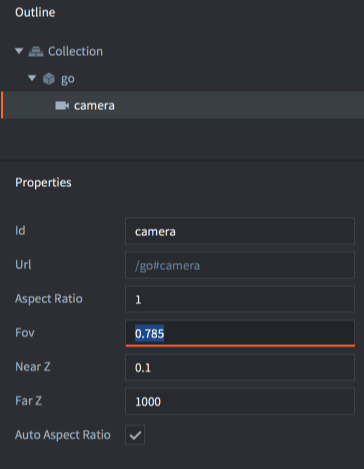
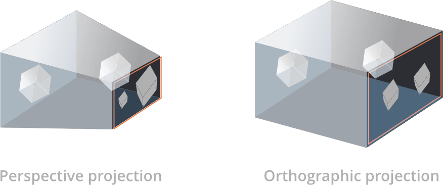

# Cameras

A camera in Defold is a component that changes the viewport and projection of the game world. Out of the box, Defold ships with a built in render script that renders the game with no need of a camera component but you can easily replace the built in script with one that renders the game to your liking.

The camera component defines a bare bones perspective camera that provides a view and projection matrix to the render script. If you need advanced features like chasing, zooming, shake etc you will need to implement it. There are a few library camera solutions that implements common camera features. They are available from the Defold community assets portal:

- [Rendercam](https://www.defold.com/community/projects/84064/) by Ross Grams.
- [Ortographic camera](https://www.defold.com/community/projects/76573/) by Björn Ritzl.

## Creating a camera

To create a camera, <kbd>right click</kbd> a game object and select <kbd>Add Component ▸ Camera</kbd>. You can alternatively create a component file in your project hierarchy and add the component file to the game object.

{srcset="images/camera/create@2x.png 2x"}

The camera component has the following properties that defines the camera *frustum*:

{srcset="images/camera/settings@2x.png 2x"}

Id
: The id of the component

Aspect Ratio
: The ratio between the frustum width and height. 1.0 means that you assume a quadratic view. 1.33 is good for a 4:3 view like 1024x768. 1.78 is good for a 16:9 view. This setting is ignored if *Auto Aspect Ratio* is set.

Fov
: The *vertical* camera field of view expressed in _radians_. The wider the field of view, the more the camera will see. Note that the current default value (45) is misleading. For a 45 degree field of view, change the value to 0.785 ($\pi / 4$).

Near Z
: The Z-value of the near clipping plane.

Far Z
: The Z-value of the far clipping plane.

Auto Aspect Ratio
: Set this to let the camera automatically calculate the aspect ratio.

## Using the camera

To activate a camera and have it feed its view and projection matrices to the render script, you send the component an acquire_camera_focus message:

```lua
msg.post("#camera", "acquire_camera_focus")
```

Each frame, the camera component that currently has camera focus will send a `"set_view_projection"` message to the "@render" socket, i.e. it will arrive to your render script:

```lua
-- example.render_script
--
function update(self)
    ...
    render.set_view(self.view)
    render.set_projection(self.projection)
    ...
end

function on_message(self, message_id, message)
    if message_id == hash("set_view_projection") then
        self.view = message.view                    -- [1]
        self.projection = message.projection
    end
end
```
1. The message posted from the camera component includes a view matrix and a projection matrix.

## Projections

The camera component currently supplies the render script with a perspective projection. This is well suited for 3D games. For 2D games, it is often desirable to render the scene with *orthographic projection*. This means that the view of the camera is no longer dictated by a frustum, but by a box. Orthographic projection is unrealistic in that it does not alter the size of objects based on their distance. An object 1000 units away will render at the same size as an object right in front of the camera.

{srcset="images/camera/projections@2x.png 2x"}

To use orthographic projection you can ignore the projection matrix sent by the camera component and instead provide one yourself in the render script, just like the default renderscript does:

```lua
-- example_orthographic.render_script
--
function update(self)
    ...
    render.set_view(self.view)
    local w = render.get_width() / 2
    local h = render.get_height() / 2
    local ortho = vmath.matrix4_orthographic(-w, w, -h, h, -1, 1)
    render.set_projection(ortho)                    -- [1]
    ...
end

function on_message(self, message_id, message)
    if message_id == hash("set_view_projection") then
        self.view = message.view                    -- [2]
    end
end
```
1. Set up an orthographic projection based on the width and height of the game window. The center of view is the camera's position. Note that the default render script sets the lower left corner of the view at the camera's position.
2. Only care about camera view since the projection is done separately.
