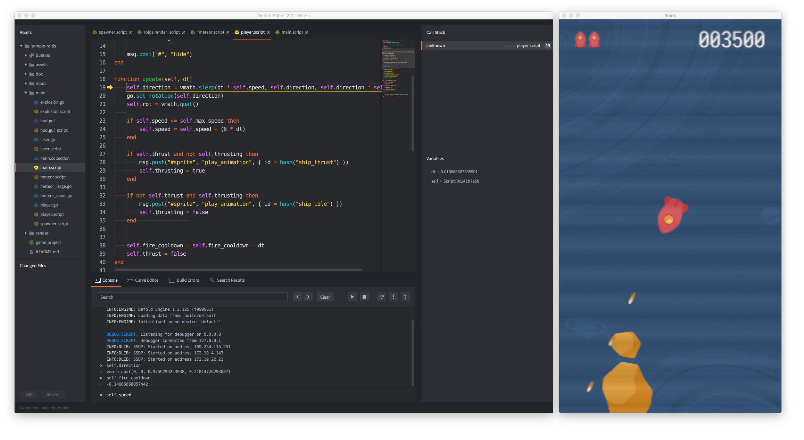
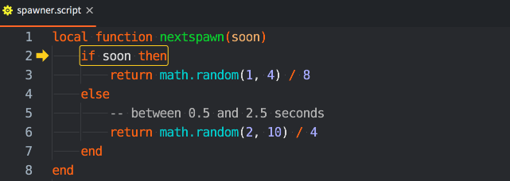
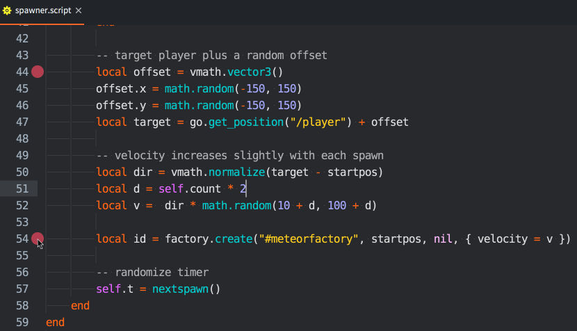
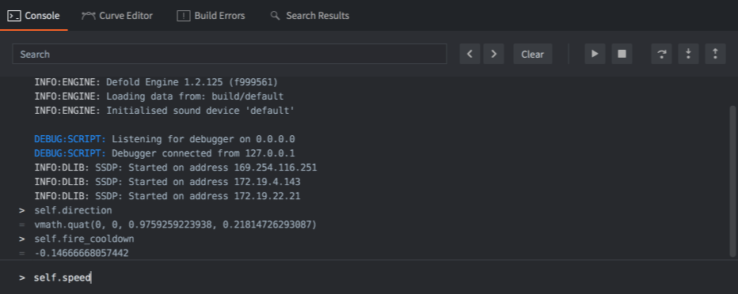
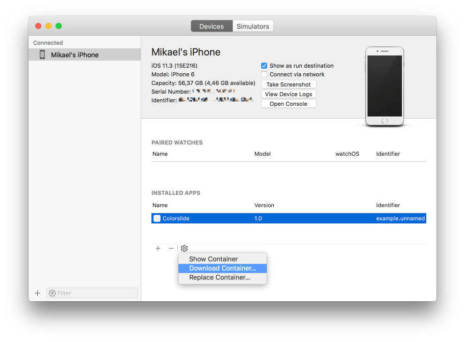

# Debugging

Defold contains an integrated Lua debugger with an inspection facility. Together with the built in [profiling tools](/manuals/profiling) it is a powerful tool that can help finding the root cause of bugs or performance issues.

## Print and visual debugging

The simplest way to debug your game in Defold is to use [print debugging](http://en.wikipedia.org/wiki/Debugging#Techniques). The technique is simply to use `print()` or [`pprint()`](/ref/builtins#pprint) statements to watch variables or indicate the flow of execution. If a game object without a script acts weird, you can just attach a script to it with the sole purpose of debugging. Using any of the printing functions will print to the *Console* view in the editor.  In addition to printing, the engine can also draw debug text and straight lines on the screen. This is done by posting messages to the `@render` socket:

```lua
-- Draw value of "my_val" with debug text on the screen
msg.post("@render:", "draw_text", { text = "My value: " .. my_val, position = vmath.vector3(200, 200, 0) })

-- Draw debug line between player and enemy on the screen
local start_p = go.get_position("player")
local end_p = go.get_position("enemy")
local color_red = vmath.vector4(1, 0, 0, 1)
msg.post("@render:", "draw_line", { start_point = start_p, end_point = end_p, color = color_red })
```

The visual debug messages adds data to the rendering pipeline and is drawn as part of the regular render pipeline.

* `"draw_line"` adds data that is rendered with the `render.draw_debug3d()` function in the render script.
* `"draw_text"` is rendered with the "/builtins/fonts/system_font.font" that uses the "/builtins/fonts/system_font.material" material.

Note that you probably want to update this data every frame so posting the messages in the `update()` function is a good idea.

## Running the debugger

To run the debugger, either <kbd>Debug ▸ Run with Debugger</kbd> which starts up the game with the debugger attached, or select <kbd>Debug ▸ Attach Debugger</kbd> to attach the debugger to an already running game.

{srcset="images/debugging/overview@2x.png 2x"}

As soon as the debugger is attached, you have control of the execution of the game through the debugger control buttons in the console, or through the <kbd>Debug</kbd> menu:

Break
: {width=60px .left} 
  Break execution of the game immediately. The game will break at its current point. You are now able to inspect the state of the game, advance the game step by step, or continue running it until the next breakpoint. The current point of execution is marked in the code editor:
  
  {srcset="images/debugging/script@2x.png 2x"}

Continue
: {width=60px .left}
  Continue running the game. The game code will continue to run until you either press pause or the execution hits a breakpoint that you have set. If execution breaks at a set breakpoint, the the execution point is marked in the code editor on top of the breakpoint marker:

  {srcset="images/debugging/break@2x.png 2x"}

Stop
: {width=60px .left}
  Stop the debugger. Pressing this button will immediately stop the debugger, detach it from the game and terminate the running game.

Step Over
: {width=60px .left}
  Advance execution of the program one step. If the execution involves running another Lua function, the execution _will not step into the function_ but continue running and stop on the next line below the function call. In this example, if the user presses "step over", the debugger will execute code and stop at the `end` statement below the line with the call to the function `nextspawn()`:

  {srcset="images/debugging/step@2x.png 2x"}

::: sidenote
A line of Lua code does not correspond to a single expression. Stepping in the debugger moves ahead one expression at a time, meaning that currently you may have to hit the step button more than once to advance to the next line.
:::

Step Into
: {width=60px .left}
  Advance execution of the program one step. If the execution involves running another Lua function, the execution _will step into the function_. Calling the function adds an entry to the call stack. You can click each entry in the call stack list to view the entry point and the content of all variables in that closure. Here, the user has stepped into the function `nextspawn()`:

  {srcset="images/debugging/step_into@2x.png 2x"}

Step Out
: {width=60px .left}
  Continue execution until it returns from the current function. If you have stepped execution into a function, pressing the button "step out" will continue execution until the function returns.

Setting and clearing breakpoints
: You can set an arbitrary number of breakpoints in your Lua code. When the game runs with the debugger attached, it will stop execution at the next breakpoint it encounters and wait for further interaction from you.

  {srcset="images/debugging/add_breakpoint@2x.png 2x"}

  To set or clear a breakpoint, click in the column just right of the line numbers in the code editor. You can also select <kbd>Edit ▸ Toggle Breakpoint</kbd> from the menu.

Evaluating Lua expressions
: With the debugger attached and the game stopped at a breakpoint, a Lua runtime is available with the current context. Type Lua expressions in the bottom of the console and press <kbd>Enter</kbd> to evaluate them:

  {srcset="images/debugging/console@2x.png 2x"}

  It is currently not possible to modify variables through the evaluator.

Detaching the debugger
: Select <kbd>Debug ▸ Detach Debugger</kbd> to detach the debugger from the game. It will continue running immediately.

## Debugging on mobile devices

Some issues can be hard to debug with the editor debugger. Diagnosing problems such as native crashes and out of memory issues may need you to connect to the devices with USB cable and make use of a terminal.

Android
: Once your game is launched on your Android device, you can view all program output and crash stacktraces using the "adb" tool, which is part of the Android SDK. Documentation for "adb" and installation links can be found here: https://developer.android.com/studio/command-line/adb.html

  Once installed and setup, connect your device with USB, open a terminal and run:

  ```txt
  cd <path_to_android_sdk>/platform-tools/
  adb logcat
  ```

  The device will then dump all the output to the current terminal, along with any prints from the game.

iOS
: On iOS you can attach the LLDB debugger to a game running on device. To debug a game it needs to be signed with a “Apple Developer Provisioning Profile” that include the device you want to debug on. Bundle the game from the editor and supply the provisioning profile in the bundle dialog (bundling for iOS is only available on macOS).

  To launch the game and attach the debugger you will need a tool called [ios-deploy](https://github.com/phonegap/ios-deploy). Install and debug your game by running the following in a terminal:

  ```txt
  ios-deploy --debug --bundle <path_to_game.app> # NOTE: not the .ipa file
  ```

  This will install the app on your device, start it and automatically attach a LLDB debugger to it. If you are new to LLDB, read [Getting Started with LLDB](https://developer.apple.com/library/content/documentation/IDEs/Conceptual/gdb_to_lldb_transition_guide/document/lldb-basics.html).


## Extracting the log.txt file

If you enable the *Write Log* setting in "game.project", any game output will be written to disk, to a file called "log.txt". Here is how you extract the file if you run the game on device:

iOS
: Connect your device to a computer with macOS and Xcode installed.
  
  Open Xcode and go to <kbd>Window ▸ Devices and Simulators</kbd>.

  Select your device in the list, then select the relevant app in the *Installed Apps* list.

  Click the cog icon below the list and select <kbd>Download Container...</kbd>.

  {srcset="images/debugging/download_container@2x.png 2x"}

  Once the container has been extracted it will be shown in *Finder*. Right click the container and select <kbd>Show Package Content</kbd>. Locate the file "log.txt", which should be located in "AppData/Documents/".

Android
: The ability to extract the "log.txt" depends on OS version and manufacturer. Here is a short and simple step by step guide: https://stackoverflow.com/a/48077004/129360

## Running the ZeroBrane external debugger

In addition to the built in debugger, it is also possible to use the Lua IDE _ZeroBrane Studio_ as an external Lua debugger. Please refer to the [ZeroBrane debugging manual](/manuals/zerobrane) for details on how to set up and run the program with Defold.

## Lua debug library

Lua comes with a debug library that is useful in some situations, particularly if you need to inspect the innards of your Lua environment. You can find more information about it here: http://www.lua.org/pil/contents.html#23.

## Debugging checklist

If you encounter an error or if your game does not behave like expected, here is a debugging checklist:

1. Check the console output and verify that there are no runtime errors.

2. Add `print` statements to your code to verify that the code is actually running.

3. If it's not running, check that you have done the proper setup in the editor required for the code to run. Is the script added to the right game object? Have your script acquired input focus? Are the input-triggers correct? Is the shader code added to the material? Etc.

4. If your code is depending on the values of variables (in an if-statement, for example), either `print` those values where they are used or checked, or inspect them with the debugger.

Sometimes finding a bug can be a hard and time consuming process, requiring you to go through your code bit by bit, checking everything and narrowing down the faulty code and eliminating sources of error. This is best done by a method called "divide and conquer":

1. Figure out which half (or less) of the code that must contain the bug.
2. Again, figure out which half, of that half, must contain the bug.
3. Continue narrowing down the code that must cause the bug until you find it.

Happy hunting!