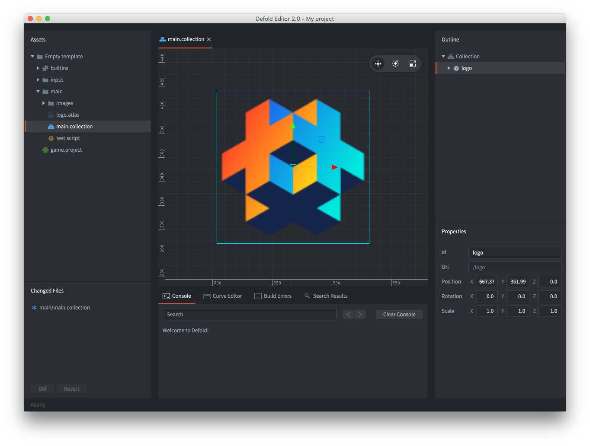
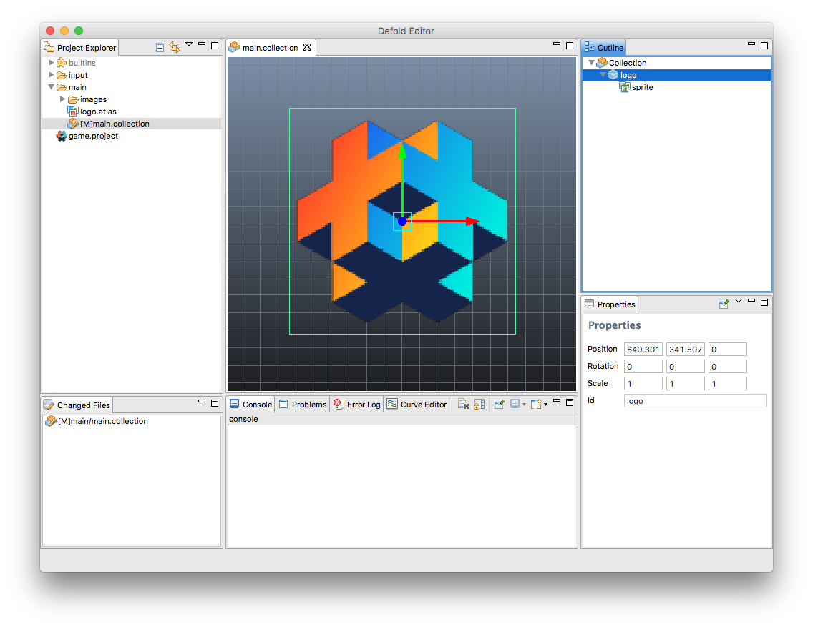

## Редактор 1 и 2

Сейчас мы постепенно переходим на Редактор версии 2 (к чему и Вас призываем), который сейчас находится в бете. Большинство документации сейчас пишется именно из расчета на работу в новом редакторе и постепенно вся документация будет обновлена, но этот процесс займет некоторое время. Вы можете отличить версию редактора на скриншотах по цветовой схеме.

Редактор 2 имеет приятную темную тему:

Редактор 1 представлен с стандартной светлой теме:

Мы настоятельно рекомендуем использовать [Редактор версии 2](https://www.defold.com/editor-two/).
