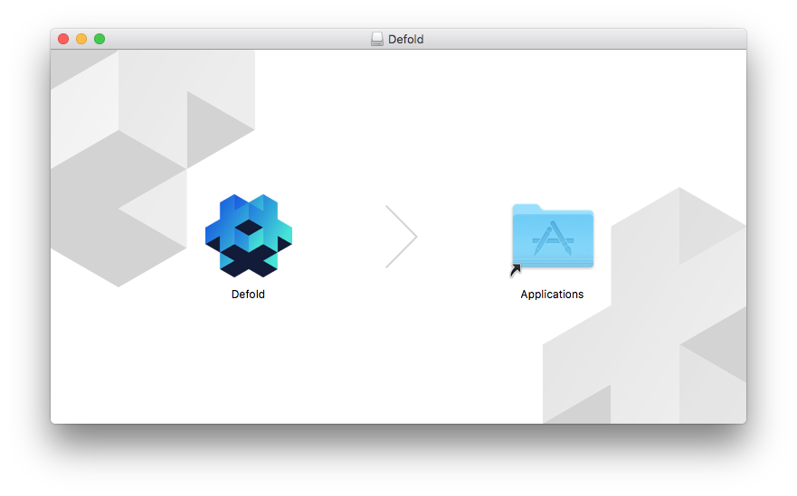

## Скачивание

Если вы ещё не скачали и не установили редактор, то самое время это сделать!

Авторизуйтесь на [Defold Dashboard](//dashboard.defold.com) и найдите там  кнопку меню "Download editor":


Нажмите "Download editor" и выберите подходящий для вас установочный пакет:

* MacOS
* Windows (32 bit)
* Windows (64 bit)
* Linux (64 bit)

Билды редактора первой версии также доступны.

## Установка

Установка на MacOS
: Скачиваемый файл-это DMG образ содержащий програму.

  1. Найдите файл "Defold-x86_64-darwin.dmg" и откройте его двойным щелчком.
  2. Перетащите приложение "Defold" в папку "Applications".

  Чтобы запустить редактор, откройте вашу папку "Applications" и <kbd>двойным щелчком</kbd> запустите файл "Defold".

  

Установка на Windows
: Скачиваемый файл - это ZIP архив, который необходимо будет распаковать:

  1. Найдите файл архива "Defold-x86_64-win32.zip" (или "Defold-x86-win32.zip" для 32разрядной Windows), <kbd>щелкните правой кнопкой мыши</kbd> по нему, выберите *Извлечь все*, и следуя инструкциям архиватора извлеките архив в папку "Defold".
  2. Переместите папку "Defold" в "C:\Program Files (x86)\"  (но это не обязательно, редактор прекрасно работает из любого места на диске)
  
  Чтоб запустить редактор, откройте папку "Defold" и <kbd>двойным щелчком</kbd> запустите файл "Defold.exe".

  

Установка на Linux
: Скачиваемый файл - это ZIP архив, который необходимо будет распаковать:

  1. Из терминала, найдите файл "Defold-x86_64-linux.zip" и распакуйте его в папку "Defold".

     ```bash
     $ unzip Defold-x86_64-linux.zip -d Defold
     ``` 

  Чтоб запустить редактор, перейдите в папку, куда вы распаковали приложение, и запустите исполняемый файл `Defold`, или <kbd>двойным щелчком</kbd> запустите его с рабочего стола.

  ```bash
  $ cd Defold
  $ ./Defold
  ``` 
