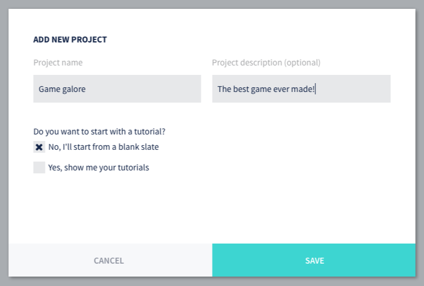

## Создание нового проекта

Перед тем как начать работать над игрой, необходимо создать хранилище для кода и файлов проекта. Самый простой способ - это создать проект используя Defold Dashboard. При этом автоматически будет создан Git репозиторий на нашем облачном сервисе, где и будет храниться ваш проект.

1. Зайдите в [Defold Dashboard](//www.defold.com/dashboard/).
2. Щелкните New Project.
3. Задайте имя вашего проекта и выберите *Start from a blank slate*.
4. Нажмите *Save*, и готово!.

